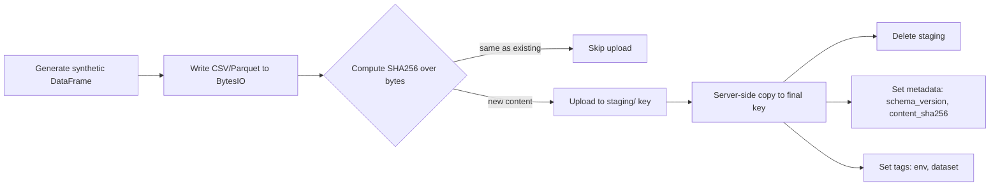

# s3-minio-starter

A lean, production-minded starter that shows you can **read/write data to AWS S3 or an existing MinIO**, with:

* **Environment-driven config** (switch S3 ↔ MinIO without code changes)
* **Atomic writes** (staging → commit)
* **Idempotency** via **content SHA256** metadata (skips duplicate uploads)
* **Multipart uploads** with retries/backoff
* **Partitioned keys**, **object tags**, and **metadata**
* **Presigned GET/PUT URLs** (secure, time-limited sharing)
* **Minimal IAM** samples
* **Tests** with `moto`

---


## Features

* S3 **and** MinIO via env (`ENDPOINT_URL`, `USE_PATH_STYLE`)
* **CSV+gzip** or **Parquet** uploads
* **Atomic**: upload to `staging/…` then copy to final key
* **Idempotent**: stores `content_sha256` in object metadata; re-upload skips when content identical
* **Multipart** with `TransferConfig` and botocore retry config
* **Partitioned layout**: `curated/<dataset>/date=YYYY-MM-DD/part-00000.csv.gz`
* **Presigned URLs** for GET/PUT (CLI)
* **Minimal IAM** JSON policy and **GitHub OIDC** trust policy samples
* **Tests**: fast unit tests with `moto` mocks

---

## Architecture (at a glance)



---

## Repo structure

```
s3-minio-starter/
├─ README.md
├─ pyproject.toml
├─ .env.example
├─ src/
│  ├─ __init__.py
│  ├─ config.py               # env config (pydantic-settings)
│  ├─ storage_client.py       # S3/MinIO abstraction, atomic/idempotent writes
│  ├─ dataset.py              # synthetic "rides" generator
│  ├─ validate.py             # minimal schema checks
│  ├─ hashing.py              # SHA256 utilities
│  ├─ logging_utils.py        # JSON logger
│  └─ cli.py                  # click CLI: ingest/ls/presign-get/presign-put
├─ scripts/
│  └─ sample_iam_policies/
│      ├─ s3_least_privilege.json
│      └─ github_oidc_trust_policy.json
├─ tests/
│  ├─ test_storage_client_moto.py
│  └─ test_ingest_idempotent.py
└─ .github/workflows/ci.yml
```

---

## Getting started

### 1) Python & install

```bash
python -m venv .venv
source .venv/bin/activate  # Windows: .venv\Scripts\activate
pip install -e ".[dev]"
cp .env.example .env
```

### 2) Configure via `.env`

| Variable                  |       Default | Meaning                                                      |
| ------------------------- | ------------: | ------------------------------------------------------------ |
| `STORAGE_BACKEND`         |          `s3` | `s3` for AWS S3, `minio` for MinIO                           |
| `BUCKET_NAME`             | `your-bucket` | Target bucket name                                           |
| `AWS_REGION`              |   `eu-west-1` | AWS region (S3)                                              |
| `AWS_PROFILE`             |     *(empty)* | Local profile name (optional)                                |
| `AWS_ROLE_ARN`            |     *(empty)* | Role to assume via OIDC, etc. (optional)                     |
| `ENDPOINT_URL`            |     *(empty)* | MinIO or custom S3 endpoint (e.g., `http://minio.host:9000`) |
| `USE_PATH_STYLE`          |           `0` | Set `1` for MinIO (path-style addressing)                    |
| `PRESIGN_DEFAULT_EXPIRES` |         `900` | Default presign TTL (seconds)                                |
| `DATASET_NAME`            |       `rides` | Default dataset for CLI                                      |
| `DEFAULT_PREFIX`          |    `curated/` | Default target prefix for ingest                             |

> **AWS S3:** leave `ENDPOINT_URL` empty, `USE_PATH_STYLE=0`.
> **MinIO:** set `ENDPOINT_URL` to your MinIO URL and `USE_PATH_STYLE=1`.

### 3) Credentials

* **AWS S3:** use `aws configure`, environment vars, or role assumption via OIDC.
* **MinIO:** export access/secret via standard AWS envs (e.g., `AWS_ACCESS_KEY_ID`, `AWS_SECRET_ACCESS_KEY`) that your MinIO server expects; set `ENDPOINT_URL` and `USE_PATH_STYLE=1`.

---

## CLI usage

### Ingest synthetic data

```bash
# 100k records, CSV+gzip to curated/rides/date=2025-09-21/part-00000.csv.gz
python -m src.cli ingest \
  --dataset rides \
  --n 100000 \
  --date 2025-09-21 \
  --format csv \
  --compress gzip \
  --target-prefix curated/
```

* If an object with the same **content** already exists at that key, the upload is **skipped**.
* For Parquet instead:

  ```bash
  python -m src.cli ingest --dataset rides --n 100000 --date 2025-09-21 --format parquet
  ```

### List keys under a prefix

```bash
python -m src.cli ls curated/rides/date=2025-09-21/
```

### Presigned URLs

```bash
# GET, 15 minutes
python -m src.cli presign-get --key curated/rides/date=2025-09-21/part-00000.csv.gz --expires 900

# PUT, 10 minutes
python -m src.cli presign-put --key curated/tmp/upload-target.csv.gz --expires 600
```

Use with `curl`:

```bash
curl -L "<PRESIGNED_GET_URL>" -o data.csv.gz

curl -X PUT -T data.csv.gz "<PRESIGNED_PUT_URL>"
```

---

## Data schema (synthetic `rides`)

Columns:

* `ride_id` (int), `user_id` (int), `driver_id` (int)
* `pickup_ts`, `dropoff_ts` (timestamps)
* `distance_km` (float), `fare_usd` (float)
* `city` ∈ {`AMS`, `RTM`, `EIN`, `UTR`, `HAG`}
* `status` ∈ {`completed`, `cancelled`, `no_show`}

You can extend `src/dataset.py` to add your own datasets.

---

## Design choices that matter

### Atomic writes

* Uploads go to a **staging** key first, then a **server-side copy** promotes them to the final key.
* If promotion succeeds, staging is deleted. Readers never see partial files.

### Idempotency by content

* We compute a **SHA256** over the exact bytes that would be written and store it as object metadata:
  `x-amz-meta-content_sha256` (exposed via `Metadata: { "content_sha256": "…" }`)
* On re-run, if the existing object’s SHA matches, the write is **skipped**.
  This guards against accidental duplicate pipelines or replays.

### Multipart & retries

* Uses `TransferConfig(multipart_threshold=8MB)` and botocore retry config.
* You can safely handle large files or less-reliable networks.

### Partitioned keys, tags, metadata

* Default layout: `curated/<dataset>/date=YYYY-MM-DD/part-00000.csv.gz`
* Tags: `env=dev`, `dataset=rides`
* Metadata: `schema_version=1`, `content_sha256=<hex>`

---

## Minimal IAM (samples)

Grant only what’s needed:

`scripts/sample_iam_policies/s3_least_privilege.json`

```json
{
  "Version": "2012-10-17",
  "Statement": [
    { "Sid": "ListBucket",
      "Effect": "Allow",
      "Action": ["s3:ListBucket"],
      "Resource": ["arn:aws:s3:::REPLACE_BUCKET_NAME"]
    },
    { "Sid": "ObjectRW",
      "Effect": "Allow",
      "Action": ["s3:GetObject","s3:PutObject","s3:DeleteObject"],
      "Resource": ["arn:aws:s3:::REPLACE_BUCKET_NAME/*"]
    }
  ]
}
```

For GitHub Actions OIDC role assumption:

`scripts/sample_iam_policies/github_oidc_trust_policy.json`

```json
{
  "Version": "2012-10-17",
  "Statement": [{
    "Sid": "GitHubOIDCTrust",
    "Effect": "Allow",
    "Principal": {
      "Federated": "arn:aws:iam::REPLACE_AWS_ACCOUNT_ID:oidc-provider/token.actions.githubusercontent.com"
    },
    "Action": "sts:AssumeRoleWithWebIdentity",
    "Condition": {
      "StringEquals": {
        "token.actions.githubusercontent.com:aud": "sts.amazonaws.com"
      },
      "StringLike": {
        "token.actions.githubusercontent.com:sub": "repo:REPLACE_OWNER/REPLACE_REPO:*"
      }
    }
  }]
}
```

---

## Testing

Run the test suite (no AWS required):

```bash
pytest
```

What tests cover:

* Atomic + idempotent CSV uploads (second upload is skipped)
* Presigned GET/PUT URL generation

---

## CI

GitHub Actions workflow at `.github/workflows/ci.yml`:

* Installs deps
* Lints with `ruff`
* Runs tests with `pytest`

If you later enable OIDC role assumption, you can add a job that authenticates to AWS **without** static secrets.

---


## Contributing
* Fork, create a feature branch, run tests, open a PR.
* Keep code well-documented with **docstrings** (no noisy inline comments).

---

## License

MIT. See `LICENSE`.

---

## Disclaimer
* This README.md created by CHATGPT.

---

## Maintainer

**Masoud Rezvani**
If this helped you, ⭐ the repo and share your feedback!
